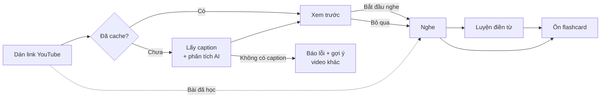
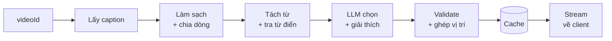

# PRD — Lyric Lab: Học ngoại ngữ qua bài hát

Cập nhật: 2026-09-24 · Tác giả: Le Trung · Trạng thái: Draft v1
Bản gốc (Claude Docs): https://claude.ai/code/artifact/51cadc8e-fa2d-4628-81f9-822e610e9e07

## 1. Tổng quan

Lyric Lab giúp người học biến bất kỳ bài hát YouTube nào thành một bài học: dán link, xem trước từ vựng và ngữ pháp đáng học, rồi nghe với lời chạy theo nhạc. Thị trường mục tiêu đầu tiên là người Việt học tiếng Trung qua C-pop.

**Vấn đề.** Người học thích nghe nhạc ngoại ngữ nhưng hiếm khi học được gì từ đó. Lời bài hát nhanh, nhiều từ lạ, nhiều cấu trúc khó. Tra từng từ thì mất cảm hứng. Các công cụ hiện có chỉ giải được một phần:

| Sản phẩm | Làm tốt | Thiếu |
| --- | --- | --- |
| LyricsTraining | Điền từ khi nghe | Không giải thích từ vựng, ngữ pháp |
| Musixmatch | Lời chạy theo nhạc, bản dịch | Không phải công cụ học |
| Language Reactor, Lingopie | Học qua phim, phụ đề song ngữ | Không tập trung vào nhạc |
| Anki | Ôn tập SRS | Phải tự làm thẻ, không có ngữ cảnh âm thanh |

**Giải pháp.** Luồng 4 bước: **Xem trước → Nghe → Luyện → Ôn**. AI chọn ra 8–12 từ và 3–5 điểm ngữ pháp hợp level người học. Mỗi mục trỏ về đúng thời điểm trong bài. Khi nghe, các từ đã xem trước được tô sáng trong lời. Từ đã lưu thành flashcard có kèm đoạn nghe lại của câu hát.

**Bài học từ AI-Lyric-Universe (bản thử nghiệm trước).**

- LLM tự viết lại lời bài hát → dễ bịa lời, rủi ro bản quyền. Bản mới lấy lời từ caption hoặc speech-to-text, không để LLM đoán.
- Lời không đồng bộ với video → không thực sự "vừa nghe vừa học". Bản mới coi timestamp là dữ liệu cốt lõi.
- Phân tích chỉ là mảng chuỗi `vocabulary[]`, `grammar[]` → nâng thành `PreviewItem` có level, ngữ cảnh, vị trí trong bài.
- Giữ lại: cache toàn cục trên Supabase, người dùng ẩn danh không cần đăng ký, YouTube embed.

## 2. Mục tiêu và chỉ số thành công

**North Star:** số **bài hát học xong mỗi tuần**. Một bài tính là học xong khi người dùng xem trước, nghe ít nhất 80% bài và lưu hoặc đánh dấu "Đã biết" ít nhất 3 mục.

Mục tiêu sản phẩm:

1. Người học hiểu được bài hát mình thích trong vòng 3 phút từ lúc dán link.
2. Người học nhớ được từ nhờ ngữ cảnh âm nhạc, không chỉ tra cứu.
3. Chi phí AI đủ thấp để chạy miễn phí ở quy mô nhỏ.

| Chỉ số | Cách đo | Mục tiêu 3 tháng sau MVP |
| --- | --- | --- |
| Tỉ lệ phân tích thành công | Link hợp lệ ra được lời có timestamp | ≥ 85% |
| Thời gian tới thẻ xem trước đầu tiên | Bài chưa cache, p50 | ≤ 8 giây |
| Thời gian tới thẻ đầu tiên | Bài đã cache, p50 | ≤ 1 giây |
| Tỉ lệ xem trước → nghe | Phiên vào màn Nghe / phiên mở Xem trước | ≥ 70% |
| Bài học xong / người dùng hoạt động / tuần | Theo định nghĩa North Star | ≥ 2 |
| Retention D7 | Quay lại trong 7 ngày | ≥ 25% |
| Tỉ lệ hoàn thành phiên ôn flashcard | Phiên ôn xong / phiên bắt đầu | ≥ 60% |
| Độ chính xác phân tích | Tỉ lệ thẻ bị báo sai | ≤ 3% |
| Chi phí AI / bài mới | Token + STT cho một bài chưa cache | ≤ 0,02 USD |

Các con số trên là mục tiêu đề xuất, cần chốt lại sau khi đo baseline trong bản beta.

## 3. Người dùng mục tiêu

MVP phục vụ người Việt đang học tiếng Trung ở trình độ HSK2–HSK5 và nghe C-pop hằng ngày. Âm Hán Việt là lợi thế riêng của nhóm này mà các app quốc tế không khai thác.

| Persona | Mô tả | Nhu cầu chính | Khó khăn hiện tại |
| --- | --- | --- | --- |
| Linh, sinh viên, HSK3 | Nghe C-pop trên YouTube mỗi tối, đang ôn thi HSK4 | Biến thời gian nghe nhạc thành thời gian ôn thi | Tra từng từ qua Pleco rất mất thời gian |
| Minh, nhân viên văn phòng, HSK4 | Học để làm việc với đối tác Trung Quốc, chỉ có 15–20 phút/ngày | Bài học ngắn, có cấu trúc, dùng trên điện thoại | Sách giáo trình nhàm chán, khó duy trì |
| Trang, fan C-drama, HSK2 | Muốn hiểu lời OST phim yêu thích | Hiểu ý nghĩa và cảm xúc của bài | Bản dịch trên mạng sai hoặc quá thoáng |

**Jobs to be done:** "Khi tôi đang nghe một bài hát tiếng Trung mình thích, tôi muốn hiểu nhanh những từ và cấu trúc quan trọng trong bài, để vừa thưởng thức vừa tiến bộ mà không phải ngồi tra từng từ."

Sau MVP mở rộng sang tiếng Hàn, tiếng Nhật và tiếng Anh, cùng người học không nói tiếng Việt (giao diện và giải thích bằng tiếng Anh).

## 4. Phạm vi

MVP chỉ làm tiếng Trung, nguồn YouTube, giao diện tiếng Việt, và chỉ xử lý video có sẵn caption lời bài hát.

| Tính năng | MVP | Sau MVP (v1.x) | Ngoài phạm vi |
| --- | --- | --- | --- |
| Dán link YouTube | Có | | |
| Link Spotify, Apple Music, TikTok | | Spotify (qua tìm video YouTube tương ứng) | Tự host audio |
| Lấy lời từ caption YouTube | Có | | |
| Speech-to-text khi không có caption | | Có, qua extension phía client | |
| Ngôn ngữ học | Tiếng Trung | Hàn, Nhật, Anh | |
| Màn Xem trước (từ vựng, ngữ pháp, tóm tắt) | Có | | |
| Lọc theo level, "Đã biết" | Có | Tự ước lượng level từ hành vi | |
| Lời chạy theo nhạc, tô sáng từ | Có (theo câu) | Theo từng từ | |
| Lặp câu, giảm tốc, bật/tắt dịch | Có | | |
| Bấm từ bất kỳ để tra | Có | | |
| Luyện điền từ | | Có | |
| Shadowing (ghi âm, so sánh) | | Có | Chấm điểm phát âm chi tiết |
| Flashcard SRS | Có (text + nút phát đoạn YouTube) | Clip audio riêng | |
| Tài khoản | Ẩn danh + đăng nhập Google để đồng bộ | | |
| Streak, gợi ý bài tiếp theo | | Có | |
| Mạng xã hội, chia sẻ, bảng xếp hạng | | | Có |
| App mobile native | | PWA | App store |
| Thu phí | | Thử nghiệm gói Pro | |

## 5. User flow chính

Xem trước là một bước riêng trước khi nghe. Khi vào chế độ nghe, danh sách đó thu gọn thành panel "Đang hát" (desktop) hoặc bottom sheet (mobile). Cả hai dùng chung một dữ liệu `PreviewItem[]`.



Link đã cache vào thẳng Xem trước. Bài đã học trước đó vào thẳng Nghe.

**Chi tiết từng bước:**

1. **Onboarding (lần đầu):** chọn ngôn ngữ đang học và level (HSK1–6, hoặc làm bài test 10 câu). Không bắt đăng ký.
2. **Dán link:** ô nhập ở trang chủ, nhận mọi dạng link YouTube (`watch?v=`, `youtu.be`, Shorts, Music). Hiển thị tiến trình: Lấy lời → Phân tích → Xong.
3. **Xem trước:** tóm tắt bài, từ vựng, ngữ pháp. Nút chính "Bắt đầu nghe", link phụ "Bỏ qua, nghe luôn".
4. **Nghe:** video nhúng, lời chạy theo nhạc, panel "Đang hát", các điều khiển lặp câu, tốc độ, bản dịch.
5. **Kết thúc bài:** tóm tắt "Bạn đã học 6 từ, 2 cấu trúc" và hai nút: "Ôn ngay" hoặc "Nghe lại".
6. **Ôn:** hàng đợi flashcard theo lịch SRS, gộp từ mọi bài đã học.

Prototype tương tác của bước 3 và 4: https://claude.ai/artifact/7YSiaMNzSVrP4tjdFHcjiP

## 6. Yêu cầu chức năng

Mức ưu tiên: **P0** = bắt buộc cho MVP, **P1** = nên có trong MVP, **P2** = sau MVP.

### 6.1 Nhập link và xử lý

| ID | Yêu cầu | Ưu tiên | Acceptance criteria |
| --- | --- | --- | --- |
| IN-01 | Nhận mọi dạng link YouTube và chuẩn hóa về `videoId` | P0 | `watch?v=`, `youtu.be/`, `/shorts/`, `music.youtube.com` đều ra cùng `videoId`. Link sai định dạng hiển thị lỗi ngay, không gọi server |
| IN-02 | Lấy caption kèm timestamp | P0 | Ưu tiên caption do người đăng tải, sau đó mới tới caption tự động. Chuẩn hóa thành danh sách dòng `{text, start, end}` |
| IN-03 | Kiểm tra chất lượng lời | P0 | Loại dòng rác (`[Music]`, ký hiệu nốt nhạc). Nếu dưới 60% dòng là chữ Hán thì báo "Bài này chưa hỗ trợ" |
| IN-04 | Hiển thị tiến trình theo từng bước | P0 | 3 trạng thái: Lấy lời, Phân tích, Xong. Có nút hủy |
| IN-05 | Xử lý khi không có caption | P0 | Thông báo rõ lý do, gợi ý tìm bản "lyrics video" của cùng bài |
| IN-06 | Speech-to-text dự phòng | P2 | Chạy phía client qua extension. Kết quả được gắn nhãn "Nhận dạng tự động, có thể sai" |

### 6.2 Màn Xem trước

| ID | Yêu cầu | Ưu tiên | Acceptance criteria |
| --- | --- | --- | --- |
| PV-01 | Tóm tắt bài | P0 | 2–3 câu tiếng Việt về nội dung, cảm xúc, 2–3 tag cảm xúc. Không trích nguyên câu hát |
| PV-02 | Danh sách từ vựng | P0 | Mặc định 8–12 mục, có nút "Xem thêm". Mỗi thẻ: chữ Hán, pinyin, âm Hán Việt, level, nghĩa trong bài, ghi chú ngữ cảnh, số lần xuất hiện, thời điểm |
| PV-03 | Danh sách ngữ pháp | P0 | 3–5 mục. Mỗi thẻ: công thức, giải thích, 1 ví dụ do AI đặt (không lấy từ lời), lỗi hay gặp của người Việt |
| PV-04 | Lọc theo level | P0 | Chỉ hiện mục có level ≥ level người dùng. Đổi level thì danh sách cập nhật ngay, không gọi AI |
| PV-05 | "Đã biết" | P0 | Ẩn mục đó ở mọi bài về sau. Có "Hoàn tác" trong phiên |
| PV-06 | "Lưu" | P0 | Thêm vào hàng đợi flashcard. Trạng thái hiển thị ngay trên thẻ |
| PV-07 | Nghe thử đoạn | P0 | Nút ▶ phát đúng câu chứa mục đó (±0,5 giây) rồi tự dừng |
| PV-08 | Hiển thị dần (streaming) | P1 | Tóm tắt hiện trước. Thẻ hiện dần. Không có màn hình chờ trống quá 3 giây |
| PV-09 | Báo sai | P1 | Mỗi thẻ có menu "Báo sai" với 3 lý do: sai nghĩa, sai pinyin, không đáng học |

### 6.3 Màn Nghe

| ID | Yêu cầu | Ưu tiên | Acceptance criteria |
| --- | --- | --- | --- |
| LS-01 | Video YouTube nhúng | P0 | Dùng YouTube IFrame Player API chính thức, không che quảng cáo hay logo |
| LS-02 | Lời chạy theo nhạc | P0 | Câu hiện tại được tô sáng và tự cuộn vào giữa. Độ lệch ≤ 300 ms so với caption |
| LS-03 | Pinyin và bản dịch | P0 | Bật/tắt riêng từng lớp. Lựa chọn được nhớ cho lần sau |
| LS-04 | Tô sáng mục xem trước trong lời | P0 | Từ vựng và ngữ pháp có hai kiểu tô khác nhau, phân biệt được cả bằng độ sáng chứ không chỉ bằng màu |
| LS-05 | Panel "Đang hát" | P0 | Hiển thị thẻ của câu đang hát, cập nhật theo thời gian phát. Mobile: bottom sheet thu gọn mặc định |
| LS-06 | Bấm từ bất kỳ để tra | P0 | Popover nghĩa theo ngữ cảnh trong ≤ 1,5 giây (đã cache ≤ 200 ms). Nút "Lưu" ngay trong popover |
| LS-07 | Bấm câu để nhảy tới | P0 | Phát từ đầu câu đó |
| LS-08 | Lặp câu | P0 | Lặp vô hạn câu hiện tại cho tới khi tắt |
| LS-09 | Giảm tốc | P0 | 0,5x / 0,75x / 1x qua `setPlaybackRate` |
| LS-10 | Phím tắt | P1 | Space phát/dừng, ←/→ câu trước/sau, L lặp câu. Chỉ hoạt động khi focus không nằm trong ô nhập |
| LS-11 | Tô sáng theo từng từ (karaoke) | P2 | Cần timestamp mức từ từ forced alignment |

### 6.4 Luyện và Ôn

| ID | Yêu cầu | Ưu tiên | Acceptance criteria |
| --- | --- | --- | --- |
| RV-01 | Flashcard SRS | P0 | Thuật toán FSRS. 4 nút: Quên, Khó, Được, Dễ. Mặt trước: chữ Hán + nút nghe đoạn. Mặt sau: nghĩa, pinyin, Hán Việt, tên bài |
| RV-02 | Hàng đợi ôn hằng ngày | P0 | Trang chủ hiển thị số thẻ đến hạn. Tối đa 20 thẻ mới/ngày (tuỳ chỉnh được) |
| RV-03 | Màn tổng kết sau bài | P1 | Số từ đã lưu, đã biết, % từ vựng bài đã hiểu |
| RV-04 | Luyện điền từ khi nghe | P2 | Ẩn các từ đã xem trước trong lời. Video tự dừng cuối câu chờ người dùng gõ pinyin hoặc chọn đáp án |
| RV-05 | Shadowing | P2 | Ghi âm câu hát, phát lại xen kẽ với bản gốc |
| RV-06 | Xuất sang Anki | P2 | File `.apkg` chứa các thẻ đã lưu |

### 6.5 Tài khoản và dữ liệu người dùng

| ID | Yêu cầu | Ưu tiên | Acceptance criteria |
| --- | --- | --- | --- |
| AC-01 | Dùng ẩn danh | P0 | Dùng được toàn bộ tính năng khi chưa đăng nhập. Dữ liệu gắn với anonymous user của Supabase |
| AC-02 | Đăng nhập Google | P0 | Đăng nhập xong thì gộp dữ liệu ẩn danh vào tài khoản, không mất thẻ nào |
| AC-03 | Lịch sử bài đã học | P0 | Danh sách bài, tiến độ, lần nghe gần nhất |
| AC-04 | Xoá dữ liệu | P1 | Người dùng tự xoá được toàn bộ dữ liệu cá nhân |

## 7. Yêu cầu phi chức năng

| Nhóm | Yêu cầu |
| --- | --- |
| Hiệu năng | LCP trang chủ ≤ 2,0 giây trên 4G. JS ban đầu ≤ 200 KB gzip. Màn Nghe giữ 60 fps khi cuộn lời |
| Độ trễ phân tích | Bài mới: thẻ đầu tiên ≤ 8 giây (p50), phân tích xong ≤ 25 giây (p95). Bài đã cache: ≤ 1 giây |
| Chi phí | ≤ 0,02 USD cho mỗi bài chưa cache. Rate limit: 10 bài mới/ngày cho tài khoản ẩn danh, 30 bài/ngày cho tài khoản đăng nhập |
| Độ tin cậy | Uptime 99,5%. Khi nhà cung cấp LLM lỗi, tự chuyển sang model dự phòng. Bài đã cache vẫn dùng được khi AI sập |
| Truy cập (a11y) | WCAG 2.2 AA. Toàn bộ thao tác làm được bằng bàn phím. Vùng bấm ≥ 44 px. Tương phản chữ ≥ 4,5:1. Tô sáng không chỉ dựa vào màu |
| Đa ngôn ngữ (i18n) | Giao diện tiếng Việt trước, chuẩn bị sẵn key cho tiếng Anh. Ngôn ngữ giải thích là một phần của cache key |
| Thiết bị | Chrome, Safari, Edge 2 phiên bản gần nhất. Responsive từ 360 px. PWA cài được lên màn hình chính |
| Bảo mật | API key AI chỉ nằm ở server. Row Level Security trên mọi bảng dữ liệu người dùng. Validate `videoId` trước khi gọi bất kỳ API nào |
| Quan sát (observability) | Log mỗi lần phân tích: thời gian từng bước, token, model, lỗi. Theo dõi tỉ lệ "Báo sai" theo model và phiên bản prompt |
| Chất lượng | Unit test cho tokenizer và bộ lọc level. Bộ đánh giá 50 bài mẫu cho prompt. E2E Playwright cho luồng dán link → xem trước → nghe |

**Lưu ý bảo mật từ bản cũ:** bản AI-Lyric-Universe để API key Groq và YouTube ở biến `VITE_*`, nghĩa là bị đóng gói vào bundle phía client. Bản mới phải chuyển toàn bộ lời gọi AI và YouTube Data API ra server, và nên đổi các key cũ.

## 8. Kiến trúc kỹ thuật

Đề xuất: **Next.js (App Router) + Supabase + hàng đợi job**. Phân tích chạy phía server, kết quả stream về client.

| Lớp | Lựa chọn | Ghi chú |
| --- | --- | --- |
| Frontend | Next.js, React, TypeScript, Tailwind | PWA. TanStack Query cho cache phía client |
| Player | YouTube IFrame Player API | Poll `getCurrentTime()` mỗi 100 ms để đồng bộ lời |
| API | Next.js Route Handlers | Stream kết quả bằng Server-Sent Events |
| Job | Inngest hoặc Trigger.dev | Chạy pipeline nhiều bước, tự retry |
| DB + Auth | Supabase Postgres, Supabase Auth | Anonymous user + Google OAuth, RLS |
| Tách từ tiếng Trung | jieba (hoặc pkuseg) | Chạy trong service Python nhỏ hoặc `nodejieba` |
| Từ điển | CC-CEDICT, danh sách từ HSK, bảng âm Hán Việt | Nạp sẵn vào Postgres |
| LLM | Groq (Llama 3.3 70B) cho tốc độ, model mạnh hơn làm dự phòng | Output JSON theo schema, có validate bằng Zod |
| Hosting | Vercel + Supabase Cloud | |

### 8.1 Pipeline phân tích



1. **Lấy caption:** dùng timedtext của video. Chuẩn hóa về `LyricLine[]` có `start`, `end`.
2. **Làm sạch:** bỏ ký hiệu, gộp dòng bị cắt đôi, chuyển phồn thể sang giản thể để tra cứu (hiển thị giữ nguyên bản gốc).
3. **Tách từ và tra từ điển (không dùng AI):** lấy pinyin, âm Hán Việt, level HSK, tần suất trong bài. Tính sẵn danh sách ứng viên.
4. **LLM:** nhận lời đã tách từ + danh sách ứng viên. Trả về tóm tắt, xếp hạng mục đáng học, nghĩa theo ngữ cảnh, điểm ngữ pháp, ví dụ mới, bản dịch từng dòng.
5. **Validate:** mỗi mục phải tìm thấy được trong lời thật. Mục không khớp vị trí thì loại bỏ. Pinyin luôn lấy từ từ điển, không lấy từ LLM.
6. **Cache:** key = `videoId + ngôn ngữ học + ngôn ngữ giải thích + phiên bản prompt`. Lọc theo level và "Đã biết" làm ở client.

### 8.2 Data model

```ts
interface LyricLine {
  index: number;
  text: string;          // lời gốc
  start: number;         // giây
  end: number;
  pinyin: string;
  translation?: string;  // bản dịch tiếng Việt
  tokens: { text: string; itemId?: string }[];
}

interface PreviewItem {
  id: string;
  type: 'vocab' | 'grammar' | 'idiom';
  term: string;            // từ hoặc công thức ngữ pháp
  reading?: string;        // pinyin
  sinoViet?: string;       // âm Hán Việt
  level: number;           // HSK 1–6
  meaningInContext: string;
  explanation?: string;
  example?: { zh: string; vi: string };
  commonMistake?: string;
  occurrences: { lineIndex: number; start: number }[];
  priority: number;        // 0–100, dùng để xếp hạng
}

interface SongAnalysis {
  videoId: string;
  summary: string;
  moods: string[];
  lines: LyricLine[];
  items: PreviewItem[];
  promptVersion: string;
}
```

| Bảng Supabase | Mục đích | Phạm vi |
| --- | --- | --- |
| `songs` | Metadata video: `videoId`, tiêu đề, kênh, thời lượng | Toàn cục |
| `song_analyses` | `SongAnalysis` dạng JSONB, theo cache key | Toàn cục, chỉ server ghi |
| `term_explanations` | Giải thích khi bấm từ ngoài danh sách | Toàn cục |
| `user_profiles` | Ngôn ngữ, level, cài đặt hiển thị | Theo user |
| `user_known_terms` | Từ đã biết | Theo user |
| `user_cards` | Flashcard + trạng thái FSRS, trỏ về bài và thời điểm gốc | Theo user |
| `user_song_progress` | Tiến độ từng bài | Theo user |
| `item_reports` | Báo sai | Theo user, admin đọc |

### 8.3 Chất lượng AI

- Prompt có phiên bản. Đổi prompt thì tăng `promptVersion` và cache mới được tạo dần.
- Bộ đánh giá 50 bài mẫu, có đáp án do người chấm. Chạy mỗi lần đổi prompt hoặc đổi model.
- Thẻ bị báo sai từ 3 người trở lên thì tự ẩn và đưa vào hàng đợi kiểm tra.

## 9. Pháp lý, bản quyền và rủi ro

Lời bài hát có bản quyền, nên sản phẩm không xây dựng một kho lời công khai. Phần này là định hướng sản phẩm, không phải tư vấn pháp lý. Cần hỏi ý kiến luật sư trước khi thu phí.

**Nguyên tắc sản phẩm:**

- Luôn hiển thị lời kèm video gốc nhúng từ YouTube. Không có trang chỉ hiển thị lời.
- Không có trang công khai có thể index được chứa lời bài hát. Trang bài học đặt `noindex`.
- Thẻ xem trước và flashcard chỉ trích cụm ngắn chứa từ đó. Ví dụ mở rộng do AI tự đặt câu mới.
- Không tải hoặc lưu trữ audio/video từ YouTube trên server, vì vi phạm điều khoản của YouTube. Nghe lại đoạn trong flashcard bằng cách phát video nhúng tại timestamp.
- Có kênh tiếp nhận yêu cầu gỡ nội dung (DMCA) và xử lý trong 72 giờ.
- Trước khi thu phí: đánh giá mua license lời từ Musixmatch hoặc LyricFind.

| Rủi ro | Khả năng | Tác động | Giảm thiểu |
| --- | --- | --- | --- |
| Nhiều video không có caption lời | Đã xảy ra (76% bài) | Cao | Nguồn lời: caption YouTube → LRCLIB (M0: phủ 86%). STT qua extension ở v1.x |
| Caption tự động sai với giọng hát | Cao | Trung bình | Ưu tiên caption do người đăng tải. Kiểm tra tỉ lệ chữ Hán. Gắn nhãn "tự động" |
| Khiếu nại bản quyền lời | Trung bình | Cao | Các nguyên tắc trên, quy trình gỡ nhanh, license khi có doanh thu |
| YouTube đổi hoặc chặn cách lấy caption | Đã xảy ra (M0: IP Vercel bị chặn 6/6 video) | Cao | Nguồn chính là LRCLIB; caption YouTube chỉ là nguồn phụ khi chạy từ IP dân cư. Tách lớp `CaptionProvider`/`LyricsProvider` để thay nguồn. Cache bền vững |
| LLM giải thích sai | Trung bình | Trung bình | Pinyin và level lấy từ từ điển. Validate vị trí. Bộ đánh giá. Nút "Báo sai" |
| Chi phí AI tăng khi có nhiều bài mới | Thấp | Trung bình | Cache toàn cục, rate limit, model rẻ cho bước đơn giản |
| Người dùng bỏ qua Xem trước | Trung bình | Thấp | Đo tỉ lệ bỏ qua. Thử nghiệm A/B phiên bản rút gọn 5 thẻ |

## 10. Roadmap và câu hỏi mở

MVP dự kiến mất khoảng 6 tuần cho một người làm bán thời gian, tính từ lúc bắt đầu code.

| Giai đoạn | Thời gian | Kết quả | Tiêu chí xong |
| --- | --- | --- | --- |
| M0 — Spike kỹ thuật | Tuần 1 | Lấy caption cho 50 bài C-pop phổ biến, đo tỉ lệ có caption dùng được | Có số liệu để chốt có cần STT sớm hay không |
| M1 — Pipeline | Tuần 2–3 | Tách từ, từ điển, prompt v1, validate, cache, bộ đánh giá 50 bài | ≤ 3% thẻ sai trên bộ đánh giá |
| M2 — Xem trước + Nghe | Tuần 3–5 | UI theo design, player đồng bộ, lọc level, "Đã biết", "Lưu" | Toàn bộ P0 của 6.1–6.3 đạt |
| M3 — Ôn + tài khoản | Tuần 5–6 | Flashcard FSRS, ẩn danh + Google, gộp dữ liệu | Toàn bộ P0 của 6.4–6.5 đạt |
| Beta kín | Tuần 7–8 | 20–30 người học tiếng Trung dùng thử | Có baseline cho các KPI ở mục 2 |
| v1.1 | Sau beta | Luyện điền từ, karaoke theo từng từ, streak | Theo kết quả beta |
| v1.2 | Sau v1.1 | Tiếng Hàn hoặc Nhật, STT qua extension, PWA | |

**Câu hỏi mở:**

- [x] Làm lại trên codebase AI-Lyric-Universe hay dựng mới? → **Dựng mới bằng Next.js** (repo này). Repo cũ chỉ để tham khảo.
- [x] Tỉ lệ video C-pop có caption lời dùng được thực tế là bao nhiêu? → **24% số bài** (12/50), quá thấp. LRCLIB phủ 86%. Xem `plans/reports/m0-caption-and-lyrics-source-spike-260925-1030-results-report.md`
- [ ] Level lấy theo HSK 2.0 (6 cấp) hay HSK 3.0 (9 cấp)?
- [ ] Tên sản phẩm chính thức: giữ "Lyric Lab", dùng lại "AI Lyric Universe", hay tên khác?
- [ ] Mô hình thu phí sau này: freemium theo số bài mới/ngày, hay gói Pro mở khóa luyện tập và xuất Anki?
- [ ] Có hiển thị bản dịch toàn bài mặc định không, hay ẩn đi để khuyến khích người học tự hiểu trước?
