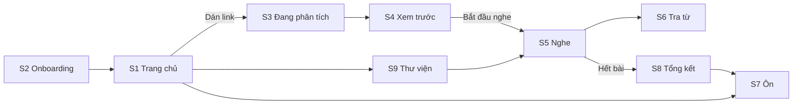

# Design Brief — Lyric Lab

Cập nhật: 2026-09-24 · Tác giả: Le Trung
Bản gốc (Claude Docs): https://claude.ai/code/artifact/44714360-9f15-4784-84be-26d45b1aba34

Tài liệu này dành cho designer (người hoặc AI) thiết kế giao diện Lyric Lab từ đầu. Mọi thông tin cần thiết đều nằm trong tài liệu, không cần tham khảo sản phẩm nào khác.

## 1. Sản phẩm và người dùng

Lyric Lab là web app (ưu tiên mobile, dùng tốt trên desktop) giúp người Việt học tiếng Trung qua bài hát. Người dùng dán link YouTube của một bài hát bất kỳ. App phân tích lời, chọn ra từ vựng và ngữ pháp đáng học, rồi cho người dùng vừa nghe vừa học.

**Ý tưởng cốt lõi:** học trước rồi mới nghe. Trước khi phát nhạc, người dùng xem 8–12 từ và 3–5 điểm ngữ pháp quan trọng nhất của bài. Khi nghe, những mục đó được tô sáng trong lời, nên người dùng nhận ra chúng ngay khi ca sĩ hát tới.

**Luồng chính (4 bước):**

1. **Xem trước:** tóm tắt bài, thẻ từ vựng, thẻ ngữ pháp.
2. **Nghe:** video phát, lời chạy theo nhạc, panel hiển thị các mục của câu đang hát.
3. **Luyện:** điền từ còn thiếu khi nghe (giai đoạn sau, chỉ cần thiết kế ở mức concept).
4. **Ôn:** flashcard theo lịch lặp lại ngắt quãng. Mỗi thẻ có nút nghe lại đúng đoạn hát chứa từ đó.

| Persona | Mô tả | Điều họ cần từ giao diện |
| --- | --- | --- |
| Linh, sinh viên, HSK3 | Nghe C-pop mỗi tối, đang ôn thi HSK4, dùng laptop và điện thoại | Thấy rõ level của từng từ, lưu từ nhanh |
| Minh, nhân viên văn phòng, HSK4 | Chỉ có 15–20 phút/ngày, học trên điện thoại khi di chuyển | Phiên học ngắn, thao tác một tay |
| Trang, fan phim Hoa ngữ, HSK2 | Muốn hiểu lời nhạc phim yêu thích | Bản dịch dễ hiểu, không bị ngợp bởi quá nhiều thông tin |

**Điểm khác biệt cần thể hiện qua thiết kế:** âm Hán Việt hiển thị cạnh pinyin (ví dụ 离开 = ly khai). Đây là lợi thế riêng của người Việt và nên được nhìn thấy rõ trên mọi thẻ từ.

## 2. Nguyên tắc thiết kế và hướng visual

Cảm giác tổng thể: **một cuốn sổ tay âm nhạc ấm áp**, không phải một app thi cử. Âm nhạc là nhân vật chính, công cụ học là phần hỗ trợ.

**Nguyên tắc:**

1. **Ít mà chất.** Mỗi màn hình chỉ có một hành động chính. Không hiển thị quá 12 thẻ cùng lúc.
2. **Chữ Hán là trung tâm.** Chữ Hán luôn lớn và rõ nhất trên thẻ. Pinyin, âm Hán Việt và nghĩa xếp theo thứ bậc giảm dần.
3. **Nghe được ở mọi nơi.** Bất kỳ thẻ nào gắn với bài hát cũng có nút ▶ phát đúng đoạn.
4. **Không làm gián đoạn khi đang nghe.** Khi nhạc phát, giao diện lùi lại: không popup tự mở, không thông báo.
5. **Hai loại mục học phân biệt rõ.** Từ vựng và ngữ pháp có màu và kiểu tô khác nhau, phân biệt được cả khi không nhìn màu.

**Hướng visual đề xuất** (designer được tự do đề xuất hướng khác nếu tốt hơn):

| Yếu tố | Đề xuất |
| --- | --- |
| Nền | Giấy ấm, hơi ngà (khoảng `#F4EFE6`). Bề mặt thẻ sáng hơn nền một bậc |
| Màu chữ | Mực nâu đen (khoảng `#1E1A16`), không dùng đen thuần |
| Màu nhấn từ vựng | Đỏ son, gợi con dấu triện (khoảng `#B23A26`). Dùng cho nút chính và tô sáng từ vựng |
| Màu nhấn ngữ pháp | Xanh cổ vịt trầm (khoảng `#255E5E`). Dùng gạch chân thay vì nền tô |
| Font chữ Hán | Serif (kiểu Noto Serif SC / Source Han Serif) cho cảm giác thư pháp, dễ đọc |
| Font Latin/tiếng Việt | Sans hỗ trợ đầy đủ dấu tiếng Việt (kiểu Be Vietnam Pro). Tránh Inter, Roboto, Arial |
| Bo góc | Thẻ 14 px, nút dạng viên thuốc |
| Dark mode | Cần có. Nền nâu than, chữ ngà, giữ hai màu nhấn nhưng tăng độ sáng để đủ tương phản |
| Minh họa | Hình khối trừu tượng, tối giản. Không dùng mascot, không dùng emoji |

**Tránh:** gradient sặc sỡ, neon, glassmorphism, card có viền trái màu, gamification quá đà (huy hiệu, pháo hoa).

## 3. Danh sách màn hình

Cần thiết kế 10 màn hình cho cả mobile (390 px) và desktop (1440 px). Màn S1–S7 là ưu tiên cao nhất.

| ID | Màn hình | Mục đích | Ưu tiên |
| --- | --- | --- | --- |
| S1 | Trang chủ / Dán link | Nhập link, xem thẻ cần ôn hôm nay, bài đã học gần đây | Cao |
| S2 | Onboarding | Chọn level lần đầu dùng | Cao |
| S3 | Đang phân tích | Hiển thị tiến trình xử lý bài hát | Cao |
| S4 | Xem trước | Học trước từ vựng và ngữ pháp | Cao |
| S5 | Nghe | Vừa nghe vừa đọc lời có tô sáng | Cao |
| S6 | Tra từ (popover) | Giải nghĩa từ bất kỳ trong lời | Cao |
| S7 | Ôn flashcard | Ôn các mục đã lưu | Cao |
| S8 | Tổng kết bài | Kết quả sau khi nghe xong | Trung bình |
| S9 | Thư viện | Lịch sử bài hát và danh sách từ đã lưu | Trung bình |
| S10 | Luyện điền từ | Concept cho giai đoạn sau | Thấp |

Thanh điều hướng chính có 3 mục: **Trang chủ**, **Ôn tập** (kèm số thẻ đến hạn), **Thư viện**. Mobile dùng tab bar dưới cùng. Desktop dùng thanh ngang trên cùng. Màn S4 và S5 ẩn thanh điều hướng để tập trung, chỉ có nút quay lại.

## 4. Đặc tả từng màn hình

### S1 — Trang chủ / Dán link

- **Hero:** ô nhập link lớn, placeholder "Dán link YouTube của bài hát…", nút "Phân tích". Trên mobile có nút "Dán" lấy từ clipboard.
- **Thẻ "Hôm nay":** số thẻ cần ôn (ví dụ "14 thẻ đến hạn"), nút "Ôn ngay".
- **Tiếp tục học:** 3–4 bài gần nhất, mỗi bài có thumbnail, tên, thanh tiến độ "Đã hiểu 72% từ vựng".
- **Trạng thái:** lần đầu dùng (chưa có bài nào: gợi ý 3 bài mẫu để thử), link sai định dạng (lỗi ngay dưới ô nhập).

### S2 — Onboarding

- Tối đa 2 bước: chọn ngôn ngữ đang học (MVP chỉ tiếng Trung, các ngôn ngữ khác hiển thị "Sắp có"), rồi chọn level HSK1–HSK6.
- Mỗi level có 1 dòng mô tả dễ hiểu, ví dụ "HSK3: giao tiếp cơ bản, biết khoảng 600 từ".
- Link phụ "Không chắc? Làm bài kiểm tra 2 phút".
- Không bắt đăng ký. Đăng nhập Google là tùy chọn, đặt ở trang cá nhân.

### S3 — Đang phân tích

- Thumbnail video và tên bài hiện ngay.
- 3 bước có trạng thái: Lấy lời bài hát → Phân tích từ vựng → Chuẩn bị bài học. Nút "Hủy".
- Thời gian chờ 5–25 giây. Thiết kế sao cho người dùng thấy nội dung sớm: tóm tắt bài và các thẻ đầu tiên có thể xuất hiện dần trước khi xong hẳn (skeleton → thẻ thật).
- **Trạng thái lỗi:** video không có lời (gợi ý tìm bản "lyrics video"), không phải tiếng Trung, video bị chặn nhúng. Mỗi lỗi có minh họa nhỏ, 1 câu giải thích, 1 hành động.

### S4 — Xem trước

Màn quan trọng nhất. Thứ tự từ trên xuống:

1. **Header bài hát:** ảnh bìa, tên bài (chữ Hán + pinyin + tên tiếng Việt), tóm tắt 2–3 câu, 2–3 tag cảm xúc, thời lượng.
2. **Nút chính "Bắt đầu nghe"** và link phụ "Bỏ qua, nghe luôn". Trên mobile, nút chính dính cố định ở đáy màn hình.
3. **Thanh lọc:** chọn level (HSK3 / HSK4 / HSK5…), dòng chú thích "Đã ẩn 3 mục dưới level của bạn", số mục đã biết kèm "Hoàn tác".
4. **Nhóm Từ vựng (8–12 thẻ):** desktop lưới 2 cột, mobile 1 cột. Chi tiết thẻ ở mục 5.
5. **Nhóm Ngữ pháp (3–5 thẻ):** desktop cột bên phải, mobile nằm dưới từ vựng (hoặc tab "Từ vựng / Ngữ pháp", designer chọn).
6. **Mini player:** bấm ▶ trên thẻ thì hiện thanh nhỏ ở đáy, phát đoạn 3–5 giây rồi tự ẩn.

Tương tác trên thẻ: **Lưu** (bật/tắt, đổi màu ngay), **Đã biết** (thẻ thu nhỏ rồi biến mất có animation, hiện toast "Hoàn tác"), **▶** (nghe đoạn), menu **⋯** (Báo sai).

### S5 — Nghe

**Desktop (2 cột):**

- **Cột trái (~60%):** video YouTube nhúng (không che logo hay quảng cáo của YouTube), thanh tiến độ, hàng điều khiển, danh sách lời.
- **Cột phải (~40%):** panel "Từ trong bài". Phần trên cùng "Đang hát" hiển thị thẻ đầy đủ của câu hiện tại, tự đổi khi sang câu mới. Phần dưới "Các mục khác" là danh sách gọn, bấm để mở rộng.

**Mobile (1 cột):** video ghim trên cùng (thu nhỏ khi cuộn), lời ở giữa, **bottom sheet** ở dưới. Bottom sheet thu gọn chỉ hiện hàng chip ngang các mục của câu đang hát, kéo lên để xem toàn bộ.

**Dòng lời:**

- Mỗi dòng gồm: thời điểm (bấm để nhảy tới), pinyin nhỏ phía trên, chữ Hán, bản dịch tiếng Việt phía dưới.
- Dòng đang hát: chữ lớn hơn (~28 px so với ~22 px), nền nổi, tự cuộn vào giữa. Các dòng khác mờ đi.
- Từ vựng đã xem trước: nền đỏ nhạt + gạch chân đậm. Ngữ pháp: chỉ gạch chân xanh. Bấm vào thì mở thẻ tương ứng trong panel.
- Từ thường (không tô sáng) vẫn bấm được, mở S6.

**Hàng điều khiển:** Phát/Dừng (nút tròn lớn), tốc độ 0,5x / 0,75x / 1x, Lặp câu này (bật/tắt, khi bật hiện "Đang lặp câu 2"), bật/tắt Pinyin, bật/tắt Bản dịch.

### S6 — Tra từ (popover / sheet)

- Desktop: popover neo vào từ được bấm. Mobile: bottom sheet nửa màn hình.
- Nội dung: chữ Hán, pinyin, âm Hán Việt, level, nghĩa trong câu này, 1 ví dụ khác, nút Lưu, nút Đã biết.
- Trạng thái đang tải (≤1,5 giây): hiện ngay chữ Hán + pinyin, phần nghĩa là skeleton.
- Nhạc không tự dừng khi mở popover (tùy chọn trong cài đặt).

### S7 — Ôn flashcard

- **Mặt trước:** chữ Hán lớn, nút ▶ nghe đoạn hát chứa từ, tên bài nhỏ phía dưới.
- **Mặt sau:** pinyin, âm Hán Việt, nghĩa, ghi chú ngữ cảnh, ví dụ.
- 4 nút đánh giá: Quên / Khó / Được / Dễ, mỗi nút ghi lần ôn tiếp theo ("10 phút", "1 ngày", "3 ngày", "7 ngày").
- Thanh tiến độ phiên ôn ("8 / 14"). Màn kết thúc phiên đơn giản, không pháo hoa.
- Thẻ ngữ pháp: mặt trước là câu ví dụ bị khuyết phần cấu trúc, mặt sau là công thức + giải thích.

### S8 — Tổng kết bài

- "Bạn vừa học xong 夜车": số từ đã lưu, số mục đã biết, vòng tròn "Hiểu 78% từ vựng của bài".
- Hành động: "Ôn ngay 6 thẻ" (chính), "Nghe lại", "Bài mới".

### S9 — Thư viện

- 2 tab: **Bài hát** (lưới thumbnail + tiến độ) và **Từ đã lưu** (danh sách có tìm kiếm, lọc theo level, loại, bài hát).
- Trạng thái rỗng cho cả hai tab.

### S10 — Luyện điền từ (concept)

- Giống S5 nhưng các từ đã xem trước bị thay bằng ô trống. Video tự dừng cuối câu.
- Người dùng chọn 1 trong 3 đáp án hoặc gõ pinyin. Phản hồi đúng/sai ngay tại ô.
- Chỉ cần 1 frame mobile + 1 frame desktop.

## 5. Thành phần UI và trạng thái

Thiết kế các thành phần dưới đây thành component dùng lại được, kèm đủ các trạng thái liệt kê.

| Component | Nội dung | Trạng thái cần vẽ |
| --- | --- | --- |
| Thẻ từ vựng (đầy đủ) | Chữ Hán (~30 px), pinyin · âm Hán Việt, chip level, nghĩa trong bài (đậm), ghi chú ngữ cảnh, hàng nút: ▶ "0:05 · 2 lần", Lưu, Đã biết, ⋯ | Mặc định, đã lưu, đang hát (viền + quầng màu nhấn), đang được mở từ lời, skeleton |
| Thẻ ngữ pháp (đầy đủ) | Công thức (ví dụ "A 比 B 还 + tính từ"), chip level, giải thích, hộp ví dụ (câu Trung + dịch), hộp "Người Việt hay sai", hàng nút | Như thẻ từ vựng |
| Dòng gọn (compact row) | Chữ Hán hoặc công thức, nghĩa ngắn, thời điểm | Mặc định, hover/pressed, mở rộng thành thẻ đầy đủ |
| Chip "Đang hát" (mobile) | Chữ Hán + pinyin + nghĩa 2–3 chữ | Mặc định, đang chọn |
| Dòng lời | Thời điểm, pinyin, chữ Hán có token tô sáng, bản dịch | Đang hát, đã qua, sắp tới, đang lặp, ẩn pinyin, ẩn dịch |
| Token trong lời | Một từ hoặc cụm | Thường, từ vựng tô sáng, ngữ pháp gạch chân, đang mở, đã biết (bỏ tô) |
| Chọn level | Nhóm nút viên thuốc HSK1–HSK6 | Chọn, không chọn, focus bàn phím |
| Ô nhập link | Icon link, ô nhập, nút Dán (mobile), nút Phân tích | Trống, đã nhập, lỗi, đang xử lý |
| Player controls | Phát/Dừng, tốc độ, lặp câu, pinyin, dịch | Từng nút: bật, tắt, disabled |
| Mini player | Nút dừng, khoảng thời gian, câu đang phát | Đang phát, kết thúc |
| Flashcard | Mặt trước, mặt sau, 4 nút đánh giá | Mặt trước, đã lật, animation lật |
| Toast | Thông báo ngắn + hành động (Hoàn tác) | Thông tin, thành công, lỗi |
| Trạng thái rỗng / lỗi | Minh họa khối, 1 câu, 1 nút | Rỗng, lỗi mạng, không có lời, không hỗ trợ ngôn ngữ |
| Tab bar / Nav | Trang chủ, Ôn tập (badge số), Thư viện | Active, inactive, có badge |

## 6. Dữ liệu mẫu

Dùng bài hát hư cấu dưới đây cho mọi màn hình. Lời do nhóm sản phẩm tự viết, không phải bài hát thật. **Không thay bằng lời của bài hát có thật** vì lời bài hát có bản quyền. Ảnh bìa dùng hình khối trừu tượng, không dùng ảnh nghệ sĩ thật.

**Bài hát:** 夜车 (Yèchē · Chuyến tàu đêm) — nghệ sĩ mẫu, 0:30 (bản demo 6 câu). Tóm tắt: "Bài ballad kể về một chuyến tàu đêm: người hát rời thành phố, mang theo kỷ niệm và hẹn bắt đầu lại khi trời sáng." Tag: Hoài niệm, Hy vọng.

| # | Thời điểm | Lời | Pinyin | Bản dịch |
| --- | --- | --- | --- | --- |
| 1 | 0:00 | 窗外的城市慢慢睡了 | chuāng wài de chéngshì mànmàn shuì le | Thành phố ngoài cửa sổ dần chìm vào giấc ngủ |
| 2 | 0:05 | 我从来没想过会离开 | wǒ cónglái méi xiǎng guò huì líkāi | Anh chưa từng nghĩ mình sẽ rời đi |
| 3 | 0:10 | 你的笑比星光还亮 | nǐ de xiào bǐ xīngguāng hái liàng | Nụ cười em còn sáng hơn cả ánh sao |
| 4 | 0:15 | 就算路再远我也不怕 | jiùsuàn lù zài yuǎn wǒ yě bú pà | Dù đường có xa mấy, anh cũng chẳng sợ |
| 5 | 0:20 | 把回忆放进口袋里 | bǎ huíyì fàng jìn kǒudài lǐ | Cất những ký ức vào trong túi áo |
| 6 | 0:25 | 等天亮了我们再出发 | děng tiānliàng le wǒmen zài chūfā | Đợi trời sáng rồi mình lại lên đường |

**Từ vựng:**

| Từ | Pinyin | Hán Việt | Level | Nghĩa trong bài | Ghi chú ngữ cảnh | Câu |
| --- | --- | --- | --- | --- | --- | --- |
| 城市 | chéngshì | thành thị | HSK3 | thành phố | Bối cảnh mở đầu: thành phố về đêm | 1 |
| 从来 | cónglái | tòng lai | HSK4 | xưa nay, từ trước đến giờ | Thường đi với 没 / 不 | 2 |
| 离开 | líkāi | ly khai | HSK3 | rời đi, rời khỏi | Rời thành phố, rời người thương | 2 |
| 星光 | xīngguāng | tinh quang | HSK5 | ánh sao | Vật so sánh cho nụ cười | 3 |
| 回忆 | huíyì | hồi ức | HSK5 | ký ức, kỷ niệm | Cũng dùng làm động từ "hồi tưởng" | 5 |
| 口袋 | kǒudài | khẩu đại | HSK4 | túi áo, túi quần | Ẩn dụ mang kỷ niệm theo bên mình | 5 |
| 天亮 | tiānliàng | thiên lượng | HSK5 | trời sáng, rạng đông | Tượng trưng khởi đầu mới | 6 |
| 出发 | chūfā | xuất phát | HSK3 | khởi hành, lên đường | Khép lại bài bằng ý bắt đầu lại | 6 |

**Ngữ pháp:**

| Công thức | Level | Giải thích | Ví dụ (AI đặt) | Người Việt hay sai | Câu |
| --- | --- | --- | --- | --- | --- |
| 从来没 + V + 过 | HSK4 | Chưa từng bao giờ làm gì | 我从来没去过北京。 — Tôi chưa từng đến Bắc Kinh. | Hay quên 过 ở cuối | 2 |
| A 比 B 还 + tính từ | HSK4 | A còn … hơn cả B | 今天比昨天还冷。 — Hôm nay còn lạnh hơn cả hôm qua. | Dùng 很 sau 比: ✗ 他比我很高 | 3 |
| 就算 … 也 … | HSK5 | Cho dù … thì vẫn … | 就算下雨，我也要去。 — Cho dù trời mưa, tôi vẫn đi. | Bỏ 也 vì tiếng Việt lược được "thì/vẫn" | 4 |
| 把 + O + V + 进 + nơi chốn | HSK4 | Đưa vật gì vào đâu (câu chữ 把) | 请把书放进包里。 — Hãy cất sách vào cặp. | Động từ sau 把 thiếu thành phần đi kèm: ✗ 我把书放。 | 5 |

**Trạng thái người dùng mẫu:** level HSK3, đã lưu 从来, 14 thẻ đến hạn hôm nay, đã học 5 bài (dùng tên bài hư cấu kiểu "雨天 · Ngày mưa", "海边 · Bờ biển").

## 7. Responsive, accessibility và deliverables

**Responsive:**

| Breakpoint | Chiều rộng | Bố cục chính |
| --- | --- | --- |
| Mobile | 360–767 px (thiết kế ở 390 px) | 1 cột, tab bar dưới, bottom sheet thay panel |
| Tablet | 768–1023 px | Như mobile nhưng lưới thẻ 2 cột |
| Desktop | ≥ 1024 px (thiết kế ở 1440 px) | 2 cột cho S4, S5. Nội dung tối đa 1280 px |

**Accessibility (WCAG 2.2 AA):**

- Tương phản chữ ≥ 4,5:1 (chữ ≥ 24 px: ≥ 3:1), kiểm tra cả light và dark mode.
- Vùng bấm ≥ 44 × 44 px.
- Tô sáng từ vựng và ngữ pháp phân biệt được bằng hình dạng (nền vs gạch chân), không chỉ bằng màu.
- Trạng thái focus bàn phím rõ ràng trên mọi nút, token lời và thẻ.
- Chữ Hán tối thiểu 16 px ở mọi nơi. Pinyin tối thiểu 12 px.
- Animation tôn trọng `prefers-reduced-motion`: tự cuộn lời và lật thẻ chuyển thành đổi tức thì.

**Deliverables mong muốn:**

1. Hướng visual: màu (light + dark), typography, spacing, bo góc, icon style, trình bày trên 1 trang.
2. Thư viện component theo mục 5, đủ trạng thái.
3. Màn S1–S9 ở mobile 390 px và desktop 1440 px, light mode. Thêm dark mode cho S4 và S5.
4. S10 dạng concept, 1 frame mỗi kích thước.
5. Prototype bấm được cho luồng: S1 dán link → S3 → S4 (lưu 1 từ, đánh dấu đã biết 1 từ) → S5 (bấm 1 từ được tô sáng, bật lặp câu) → S8 → S7.
6. Ghi chú ngắn cho các quyết định thiết kế quan trọng, đặc biệt là cách panel "Đang hát" cập nhật và cách bottom sheet hoạt động trên mobile.

**Ngoài phạm vi thiết kế lần này:** landing page marketing, trang cài đặt chi tiết, trang thanh toán, logo chính thức (dùng wordmark tạm "Lyric Lab").
